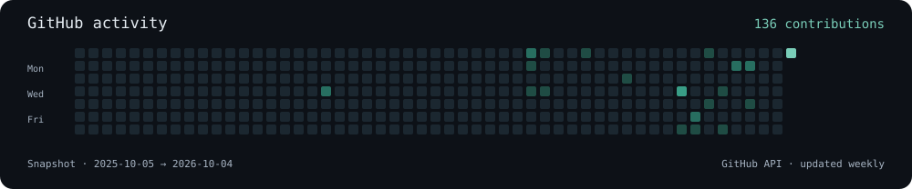

<h1 align="center">Hi, I'm Bhavesh Jain.</h1>

<strong>Data Scientist · GenAI & Multi-Agent Systems · Strategic Foresight</strong>

Turning research signals into tools that help people make decisions.

  <a href="https://bhaveshjain.com">Portfolio</a> ·
  <a href="https://blog.bhaveshjain.com">Writing</a> ·
  <a href="https://travel.bhaveshjain.com">Travel</a> ·
  <a href="https://www.linkedin.com/in/bhav1212/">LinkedIn</a> ·
  <a href="mailto:hello@bhaveshjain.com">Email</a>

## What I'm working on

I'm **Team Lead Data & Development at the Joint Innovation Hub, working at Fraunhofer ISI**. My work connects generative AI, retrieval, transparent multi-agent systems, and technology intelligence.

- **[Vorschau](https://bhaveshjain.com/#work)** · In development 
  A seven-agent foresight workflow that turns research signals into strategic briefings for small and mid-sized companies.
- **[JIH Trend Radar](https://jih-trendradar.eu/)** · Research platform 
  Research and patent signals, bibliometric analysis, and language models for exploring emerging technologies.
- **[Transparent multi-agent systems](https://doi.org/10.1007/978-3-032-29586-6_24)** · Published research 
  Inspectable enterprise AI interfaces and multi-agent retrieval-augmented generation.

**Public code:** [Chatbot-API](https://github.com/bhav1212/Chatbot-API) — a FastAPI starting design with user/session-scoped chat memory and explicit session cleanup.

## Tools & methods

| Area | Current focus |
| :--- | :--- |
| **Data & ML** | Python · SQL · PyTorch · Scikit-learn · Pandas · Polars |
| **GenAI & agents** | LLMs · RAG · LangGraph · Multi-agent systems · LLM evaluation |
| **Delivery** | FastAPI · PostgreSQL · pgvector · Docker · Git · MLOps |
| **Platforms** | OpenAI APIs · Anthropic APIs · AWS · GCP · Weights & Biases |

### What I'm studying

- **Generative AI:** context engineering, structured outputs, retrieval, and evaluation.
- **Agentic systems:** tool use, workflow orchestration, state, and human review.
- **Multi-agent systems:** coordination, reliable task completion, and transparent interfaces.
- **AI product & project management:** discovery, useful baselines, experiments, and release decisions.

## Research in print

- **2026 · [From Black Box to Glass Box: Designing Transparent Multi-Agent Systems for Enterprise Users](https://doi.org/10.1007/978-3-032-29586-6_24)** — HCI International · Springer.
- **2025 · [Multi-agent Retrieval-Augmented Generation for Enhancing Answer Generation and Knowledge Retrieval](https://doi.org/10.1007/978-3-032-05179-0_22)** — EPIA · Springer.
- **2025 · [Predicting Tech Readiness through Bibliometric Analysis using Unsupervised Machine Learning](https://doi.org/10.24406/publica-5777)** — ISPIM Conference.
- **2025 · [Generative AI in strategic foresight: a case-study analysis](https://digital.ub.uni-paderborn.de/doi/10.17619/UNIPB/1-2467)** — Symposium for Foresight and Technology Planning. German publication.

## Notes from the work

I write about the decisions around AI systems: what to build, how to evaluate it, and what happens after the demo.

- [How to Actually Evaluate an LLM Application](https://blog.bhaveshjain.com/how-to-evaluate-llm-apps.html)
- [Notes from Building Multi-Agent Eval Harnesses](https://blog.bhaveshjain.com/multi-agent-eval-harnesses.html)
- [Product Discovery Before the Backlog Gets Expensive](https://blog.bhaveshjain.com/discovery-before-backlog.html)

[Explore all writing →](https://blog.bhaveshjain.com/)

## GitHub activity

This is a weekly snapshot of GitHub-reported contributions. The native GitHub graph below shows current activity.

---

**Let's build something useful.** [hello@bhaveshjain.com](mailto:hello@bhaveshjain.com) · [Résumé](https://bhaveshjain.com/resume.pdf) · [Fraunhofer profile](https://www.isi.fraunhofer.de/de/joint-innovation-hub/mitarbeiter/jain.html)

Heilbronn, Germany · English & basic German · [A few routes outside the work](https://travel.bhaveshjain.com)
